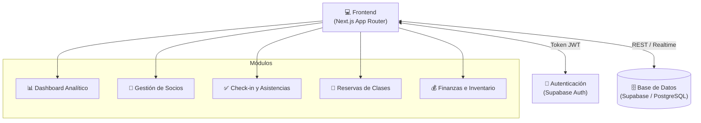

# GymOS 🏋️‍♂️

> **Sistema integral de gestión de gimnasios y centros de fitness.**

GymOS es una plataforma moderna diseñada para simplificar la administración de tu gimnasio. Desde el control de accesos y membresías hasta el análisis financiero y la gestión de inventario, GymOS centraliza todas las operaciones en un solo lugar con una interfaz intuitiva y rápida.

## 🚀 Problemas que Soluciona

- **Control de Vencimientos Manual:** Automatiza el seguimiento de las membresías, con soporte para control de vencimientos y cambios de estado de los socios.
- **Falta de Métricas Claras:** El Dashboard analítico provee KPIs en tiempo real (ingresos, asistencia, crecimiento de socios) permitiendo la toma de decisiones basada en datos.
- **Caos en las Reservas de Clases:** Sistema integrado para que los socios reserven sus lugares en las clases (Crossfit, Spinning, etc.) evitando sobrecupos.
- **Registro de Asistencia Lento:** Función de "Check-in rápido" por nombre o DNI para agilizar la entrada de los socios al establecimiento.
- **Seguimiento de Entrenamientos:** Vista dedicada para que el socio vea su progreso y rutinas (Workout mode).
- **Gestión de Inventario y Finanzas:** Registro detallado de productos, ventas y balances mensuales.

## 🏗️ Arquitectura del Sistema



## 🛠️ Stack Tecnológico

- **Framework:** [Next.js](https://nextjs.org/) (App Router)
- **Lenguaje:** [TypeScript](https://www.typescriptlang.org/)
- **Estilos:** [Tailwind CSS](https://tailwindcss.com/)
- **Base de Datos & Auth:** [Supabase](https://supabase.com/)
- **Componentes UI:** [Radix UI](https://www.radix-ui.com/) & [shadcn/ui](https://ui.shadcn.com/)
- **Animaciones:** [Framer Motion](https://www.framer.com/motion/)
- **Gráficos:** [Recharts](https://recharts.org/)

## 📂 Estructura del Proyecto

```text
├── app/
│   ├── (gym)/          # Rutas principales del dashboard (attendance, classes, dashboard, etc.)
│   └── globals.css     # Estilos globales
├── components/         # Componentes reutilizables de UI (Dashboard, Members, Layout, UI Elements)
├── lib/                # Contextos globales (GymContext, AuthContext), Definición de Tipos y Utilidades
├── supabase/           # Scripts SQL para esquemas y extensiones de base de datos
└── utils/              # Configuración y clientes de Supabase (SSR/Browser)
```

## ⚙️ Instalación y Uso

1. **Clonar el repositorio**
   ```bash
   git clone https://github.com/chinobustos/GymOS.git
   cd GymOS
   ```

2. **Instalar dependencias**
   ```bash
   npm install
   ```

3. **Configurar variables de entorno**
   Renombra el archivo `.env` a `.env.local` (o créalo si no existe) y configura tus variables de Supabase:
   ```env
   NEXT_PUBLIC_SUPABASE_URL=tu_supabase_url
   NEXT_PUBLIC_SUPABASE_ANON_KEY=tu_supabase_anon_key
   ```

4. **Ejecutar en entorno de desarrollo**
   ```bash
   npm run dev
   ```
   Abre [http://localhost:3000](http://localhost:3000) en tu navegador para ver el resultado.

## 📝 Actualizaciones Recientes

- ✅ Corrección exhaustiva de tipado estricto en TypeScript.
- ✅ Reemplazo de componentes problemáticos en Server-Side Rendering (Radix Progress) por alternativas nativas optimizadas.
- ✅ Mejora en la consistencia de las interfaces de datos (Asistencias y Reservas).
